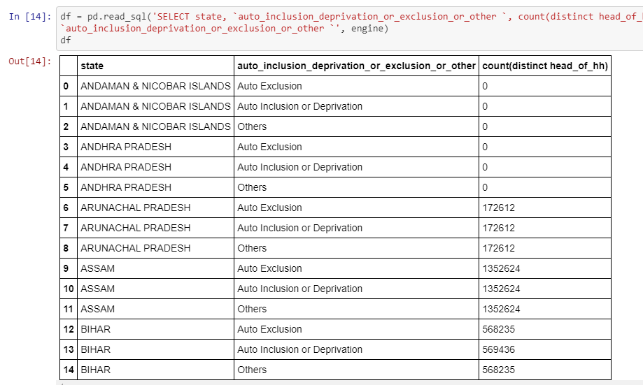

## Socio-Economic Caste Census 2011

### 🚫 This repository has been archived. The code was written to scrape data at a point in time.

We share data on 140M+ households from 19 states which were part of the 2011 SECC.

-------
Table of Contents:

1. [Scraping](#scraping)
2. [De-Duping and Removing Empty Rows](#de-duping-and-removing-empty-rows)
3. [Data](#data)
4. [Applications](#applications)
------------

### Scraping

We used [secc.py](secc.py) to scrape the data from http://164.100.129.6/netnrega/secc_list.aspx. In all, we have data over 420M records from 19 states: arunachal pradesh, assam, bihar, chhattisgarh, gujarat, haryana, kerala, madhya pradesh, maharashtra, mizoram, nagaland, odisha, punjab, rajasthan, sikkim, tamil nadu, uttar pradesh, uttarakhand, west bengal.

### De-Duping and Removing Empty Rows

The data we downloaded had over 420M rows, which is clearly too many. To clean the data, we first [download](scripts/01_download_secc.ipynb) from the [Dataverse](https://doi.org/10.7910/DVN/LIIBNB) (to which we had uploaded the data). We compare the data to the [aggregate data provided online](scripts/02_compare_secc_website.ipynb).  We found two broad reasons for excess rows: empty rows and duplicated rows. Some combinations of dropdowns have no data. In the initial data we downloaded we kept those combinations but put an empty string in all other fields starting `head_of_hh.`

There also a lot of duplicates. The duplicates stem from multiple entries for the `auto_inclusion_deprivation_or_exclusion_or_other` field per row and for village name to have multiple rows with "(GP)" and "(village)". We keep the village duplicates as they are about ~ 3M and it is not immediately clear if it is duplication or that they are different villages.

We take care of these issues in [this notebook](scripts/03_clean.ipynb). We compare this with [SQL results](scripts/04_test_clean_db.ipynb) as a robustness check. And the [following notebook](scripts/05_compare_secc_clean.ipynb) compares the final data to aggregate numbers posted. There are still differences but now we have fewer rows than excess rows. Finally, we [upload the deduped data](scripts/06_upload_dataverse.ipynb) to the Dataverse. (The file names have the word 'deduped' in them.)

### Data

The original data has the following columns:

`state, district, tehsil, panchayat, language, auto_inclusion_deprivation_or_exclusion_or_other ('auto_inclusion_or_deprivation is radio button is clicked, exlusion if that button is clicked, other if that button is clicked) head_of_hh, gender, age, social_cat, fathers_and_mothers_name, deprivation_count, auto_inclusion_deprivation_code, total_members, hh_summary_auto_inclusion, hh_summary_auto_exclusion, hh_summary_auto_other, hh_summary_deprivation`

The original and deduped data are posted at: https://doi.org/10.7910/DVN/LIIBNB

### Applications

We use the data to develop the python package [outkast](https://github.com/appeler/outkast) that infers the caste based on last name. We also use the data to estimate [percentage of female HoH by last name](https://github.com/soodoku/female_hoh)

### Authors

Suriyan Laohaprapanon and Gaurav Sood
