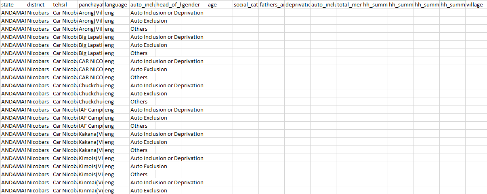

## Socio-Economic Caste Census 2011

We share data on 137M+ households from 19 states which were part of the 2011 SECC.

### Scraping

We used [secc.py](secc.py) to scrape the data from http://164.100.129.6/netnrega/secc_list.aspx. In all, we have data XXXM records from 19 states.

### Cleaning

The data we downloaded had over 420M rows, which is clearly too many. We compare it to the [aggregate data provided online](scripts/00_compare_secc_website.ipynb).  We found two broad reasons for it: empty rows and duplicated rows. Some combinations of dropdowns have no data. In the initial data we downloaded we kept those combinations but put an empty string in all other fields starting `head_of_hh.`

There also a lot of duplicates. The duplicates stem from multiple entries for the `auto_inclusion_deprivation_or_exclusion_or_other` field per row and for village name to have multiple rows with "(GP)" and "(village)".

We take care of these issues in [this notebook](scripts/03_clean.ipynb). And the [following notebook](scripts/05_compare_secc_clean.ipynb) compares the final data to aggregate numbers posted.

### Augmenting

There is a fair bit of data in native languages. We use X to add columns that provide transliterated versions in separate columns with column_name_eng.

### Data

The original data has the following columns:

`state, district, tehsil, panchayat, language, auto_inclusion_deprivation_or_exclusion_or_other ('auto_inclusion_or_deprivation is radio button is clicked, exlusion if that button is clicked, other if that button is clicked) head_of_hh, gender, age, social_cat, fathers_and_mothers_name, deprivation_count, auto_inclusion_deprivation_code, total_members, hh_summary_auto_inclusion, hh_summary_auto_exclusion, hh_summary_auto_other, hh_summary_deprivation`

The original and processed data are posted at: https://doi.org/10.7910/DVN/LIIBNB

### Applications

We use the data to develop the python package [outkast](https://github.com/appeler/outkast) that infers the caste based on last name. We also use the data to provide [sex ratio over time by last name](https://github.com/soodoku/last_sex)

### Authors

Suriyan Laohaprapanon and Gaurav Sood
